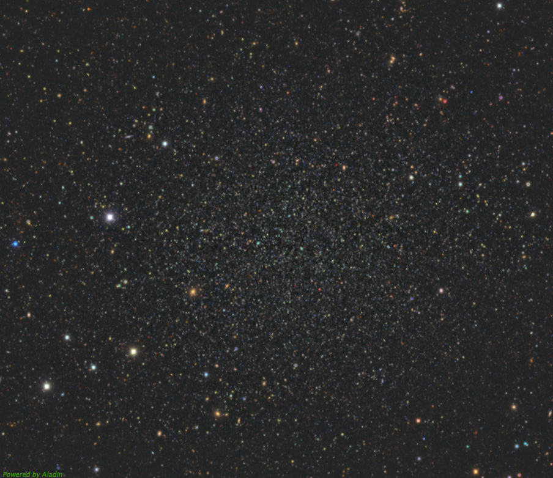

+++
title = 'Excellence in Graduate Research Symposium'
date = '2024-10-09:51:48-07:00'
featured_image = ''
+++

Here I include some additional notes and resources for my poster presented at the Excellence in Graduate Research Symposium by the Graduate Student Society ran by the University of Victoria in Fall 2024.

## Introduction to Dwarf Galaxies and N-body Modeling

Dwarf galaxies occupy the extremes of galaxies in many ways. The largest dwarf galaxies are between one hundredth to one thousandth of the Milky Way's mass. However, the smallest dwarf galaxy candidates have as few as about 50 stars total in the entire galaxy! (Is it even a galaxy anymore?). Because of dwarf's tiny stellar masses, most dwarf galaxies formed most of their stars billions of years ago. So, dwarf galaxies are *relics* from the early universe---testing our theories of the formation of galaxies and the universe. Dwarf galaxies are furthermore some of the most *dark matter dominated* objects in the universe. A typical dwarf galaxy has 100 to 1000 times more mass in mysterious dark matter than in their stars and gas. Understanding the kinematic properties of dwarf galaxies directly tests our understanding of dark matter.

Our own Milky Way has over 60 dwarf galaxies in orbit. Additionally, we have identified the remnants of many dwarf galaxies in the Milky Way's halo (the diffuse cloud of stars that extends far past the disk and bulge of the Galaxy). As these galaxies are the closest galaxies outside of our own, we can study them in detail. Most nearby dwarfs have measured orbital properties, pictures of their individual stars, and detailed chemical abundance measurements.

With this unique opportunity to study dwarf galaxies in detail, we can

## Sculptor
For my project, I have been focusing on the Sculptor dwarf spheroidal galaxy. This galaxy was first identified in 1938[^1], making it one of the first dwarf galaxies discovered (besides the large and small magellanic clouds in the southern hemisphere). Sculptor is a relatively bright and massive dwarf galaxy at a distance of about 250 thousand light years away (83 kiloparsecs (kpc)). 

## Movies

An animation of the dark matter density of Sculptor over 10 billion years of evolution around the Milky Way. 


## Acknowledgements
This research takes place on the unceded lands of the Lək̓ʷəŋən (Songhees and Esquimalt) and the W̱SÁNEĆ peoples.

- [Gadget4](https://wwwmpa.mpa-garching.mpg.de/gadget4/).
- [Agama](http://agama.software) for potential calculations.
- [Julia](https://julialang.org) for analysis.
- [Makie](https://docs.makie.org/) for plotting.

## Citations
[^1]: Shapley 1938
